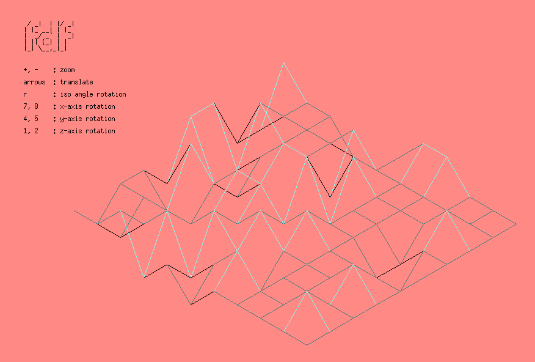

# fdf

3D wireframe viewer in C — reads a `.fdf` height map and renders it as an isometric projection with interactive controls.

---



## Build & run

```bash
# Dependencies (Debian/Ubuntu)
sudo apt install build-essential libx11-dev libxext-dev zlib1g-dev

make
./fdf maps/42.fdf
```

**Make targets:** `make` · `make clean` · `make fclean` · `make re`

---

## Controls

| Key | Action |
|-----|--------|
| `Arrow keys` | Translate |
| `+` / `-` | Zoom in / out |
| `r` | Rotate isometric angle |
| `7` / `8` | Rotate around x-axis |
| `4` / `5` | Rotate around y-axis |
| `1` / `2` | Rotate around z-axis |
| `ESC` | Exit |

---

## Map format

A grid of space-separated values. Points can carry an optional hex color:

```
0  0  0  0
0  1,0xFF0000  2,0x00FF00  0
0  0  0,0x0000FF  0
```

`z` — altitude · `z,0xRRGGBB` — altitude with color

---

## How it works

### Isometric projection

The height map is a 2D grid where each value represents altitude (`z`). To render it in 3D, each point `(x, y, z)` is projected onto the screen using an isometric transformation:

```
screen_x = (x - y) * cos(angle)
screen_y = (x + y) * sin(angle) - z
```

At the classic isometric angle (~26.57°), this produces the familiar 2:1 diamond grid. The viewer can rotate around all three axes by applying rotation matrices before projection, which is what the keypad controls do.

### Bresenham line algorithm

Once two adjacent points are projected onto the screen, a line is drawn between them. Rather than using floating-point arithmetic (slow, imprecise), the engine uses Bresenham's line algorithm — an integer-only method that decides which pixel to plot at each step by tracking an error term.

The key idea: for a line from `(x0, y0)` to `(x1, y1)`, at each step you advance along the dominant axis by 1 and accumulate the error of the secondary axis. When the error exceeds 0.5 pixels, you step the secondary axis and reset. This produces clean, gap-free lines with no floating-point math.

Color interpolation along the line is handled by linearly blending the start and end point colors based on the current step ratio.

---


- Randomized color theme on startup.
- Window size: 1300×800.
- Requires exactly one map file as argument.
